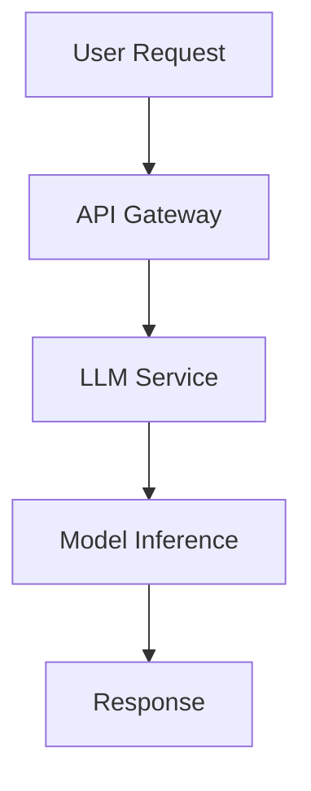

# Documentation

This directory contains comprehensive documentation for the LLM project.

## Purpose

The `docs/` directory provides:
- User guides and tutorials
- API documentation
- Architecture and design documents
- Deployment guides
- Troubleshooting and FAQ

## Structure

```
docs/
├── user-guide/        # End-user documentation
├── api/              # API reference documentation
├── architecture/     # System design and architecture
├── deployment/       # Installation and deployment guides
├── tutorials/        # Step-by-step tutorials
├── troubleshooting/  # Common issues and solutions
├── contributing/     # Developer contribution guidelines
└── assets/          # Images, diagrams, and media files
```

## Documentation Types

### User Documentation
- **Getting Started Guide** - Quick setup and basic usage
- **Feature Overview** - Detailed feature descriptions
- **Configuration Guide** - How to configure the system
- **Examples and Use Cases** - Real-world usage scenarios

### Developer Documentation
- **API Reference** - Detailed API documentation
- **Architecture Overview** - System design and components
- **Contributing Guide** - How to contribute to the project
- **Code Standards** - Coding conventions and best practices

### Operational Documentation
- **Deployment Guide** - Production deployment instructions
- **Monitoring Setup** - Logging and monitoring configuration
- **Backup and Recovery** - Data backup procedures
- **Security Guidelines** - Security best practices

## Documentation Tools

This project uses:
- **Markdown** for written documentation
- **Sphinx** or **MkDocs** for generating HTML documentation
- **OpenAPI/Swagger** for API documentation
- **Mermaid** for diagrams and flowcharts

## Building Documentation

Generate HTML documentation:
```bash
# Using MkDocs
mkdocs serve

# Using Sphinx
sphinx-build -b html docs/ docs/_build/
```

## Documentation Standards

### Writing Guidelines
- Use clear, concise language
- Include code examples where appropriate
- Keep documentation up-to-date with code changes
- Use consistent formatting and structure

### Code Examples
```python
# Always include working code examples
from llm_project import LLMClient

client = LLMClient(model="llama2")
response = client.generate("Hello, world!")
print(response.text)
```

### Diagrams and Visuals


## Contributing to Documentation

1. **Edit Existing Docs**: Update content to reflect current features
2. **Add New Sections**: Document new features or components
3. **Review and Test**: Ensure all examples work correctly
4. **Submit PR**: Follow the standard pull request process

### Documentation Checklist
- [ ] Content is accurate and up-to-date
- [ ] Code examples are tested and working
- [ ] Links are valid and functional
- [ ] Images and diagrams are properly formatted
- [ ] Grammar and spelling are correct

## Documentation Maintenance

- **Regular Reviews**: Schedule quarterly documentation reviews
- **Version Control**: Tag documentation versions with releases
- **User Feedback**: Collect and incorporate user feedback
- **Automation**: Use CI/CD to validate documentation builds

## Quick Links

- [API Reference](api/README.md)
- [Getting Started](user-guide/getting-started.md)
- [Architecture Overview](architecture/README.md)
- [Deployment Guide](deployment/README.md)
- [Contributing Guidelines](contributing/README.md)

## Feedback

Help us improve the documentation:
- Report issues or inaccuracies
- Suggest new topics or sections
- Contribute examples and tutorials
- Provide feedback on clarity and usability